# The WorldTravel Log

(Developer: Ulrike Riemenschneider)

**Live Site:**

[Live webpage](https://worldtravellog.herokuapp.com/)

**Link to Repository:**

[Repository](https://github.com/URiem/worldtravellog)

**Developed by: Ulrike Riemenschneider**

## Table of Content

- [The WorldTravel Log](#the-worldtravel-log)
  - [Table of Content](#table-of-content)
  - [Introduction](#introduction)
    - [Project Goals](#project-goals)
    - [Data Base Design](#data-base-design)
  - [User Experience - UX](#user-experience---ux)
    - [Strategy](#strategy)
    - [Scope](#scope)
    - [Structure](#structure)
    - [Skeleton](#skeleton)
    - [Surface](#surface)
  - [Agile Development](#agile-development)
  - [Existing Features](#existing-features)
  - [Future Features](#future-features)
  - [Technologies Used](#technologies-used)
    - [Languages](#languages)
    - [Python Modules \& Packages](#python-modulespackages-used)
    - [Frameworks \& Tools](#frameworks--tools)
  - [Testing and Validation](#testing-and-validation)
  - [Deployment \& Development](#deployment--development)
  - [Credits](#credits)
    - [Media](#media)
    - [Code](#code)
  - [Acknowledgements](#acknowledgements)

## Introduction

The WorldTravel Log is a website that is designed to allow users to upload and keep track of information on travels they have undertaken. Each 'Travel Log Entry' contains information on one particular trip and the user can then opt to add additional images to the log of each particular trip. Users can set up accounts that allow them to add, edit and delete entries as well as images associated with each entry. Users can also choose to give an entry a privacy setting so that only they will be able to view it and it will not be shared for all users to see.

The project was designed as the 4th portfolio project of the Code Institutes Full Stack Diploma Program. It was built using Django, Python, JS, CSS, and HTML. The data are stored in a PostgreSQL database.

### Project Goals

The goal of the project was to build a tool for users to create a repository of memories from travels so that they may share them with others, privately or publically, or use them like a small photo diary of experiences. Each travel log can be populated with a small gallery of pictures from memorable moments of the adventures. So often images from travel experiences sit in file structures on private computers and are seldom looked at. If shared on common social media sites, they disappear in a long, long timeline of social media posts that are difficult to search for or retrieve in the future. This site allows users to create log entries focusing on a specific trip, with a short description and defining information, such as the country of travel, the year, and a descriptive title. The log entries can be edited and deleted by the user who created them. To protect their privacy, users can choose to publically share a log entry or keep it private.

### Data Base Design

The Entity Relationship Diagram (ERD) illustrates the structure of the database which lies at the core of the functionality of the site:

A `User` Model is provided by Django, and a `Logentry Model` stores the details of each Triplog that a user adds, a user can add many log entries. An `Image` Model allows the user to add and store images specific to each Triplog, each Log can have multiple pictures associated with it. In addition, a `Country` Model allows the user to categorize their entries by country of travel, which then makes the log entries searchable to the user.

The `Logentry` and `Image` models are based on the blog walkthrough project by Code Institute. However, the models were significantly altered to fit the needs of this project. The `Logentry` model has added fields of 'year', 'privacy', and 'country', but the field of 'likes' was deleted. It also has an added helper method to slugify the log entry title for non-admin users. The second model from the blog walkthrough, which was designed to allow a user to add comments to a blog, has been adapted here to become a model called `Image`, which allows the author of a trip entry to add images to an image gallery below their entry. There is no admin approval needed for adding these images.

As required by the assessment criteria for this project, one custom model (the `Country` model) was added which was not covered by Code Institute's walkthrough. It is used to allow users to add more country categories (or other appropriate regions) which are then submitted for approval by the administrator.

**Future Models**

In the future, the developer would like to add a `Favorites` model, which would allow users to add Log Entries to a list of Favorites and then allow them to be displayed on a separate view from other list-views, such as the Home Page View, the My Trip View, or the Country View.

## User Experience - UX

The application was developed considering the Five Planes of User Experience:

### Strategy

| EPIC                       | ID  | User Story                                                                                                                                                                               |
| -------------------------- | --- | ---------------------------------------------------------------------------------------------------------------------------------------------------------------------------------------- |
| **CONTENT AND NAVIGATION** |     |                                                                                                                                                                                          |
|                            | 1A  | As a user, I want to see a navigation menu so I can easily move through the site.                                                                                                        |
|                            | 1B  | As a user, I want to see relevant information about the site and its content easily so I can decide if I want to register an account                                                     |
|                            | 1C  | As a user, I want to see an intuitive and visually pleasing design that matches the intent of the website.                                                                               |
|                            | 1D  | As a user, I can access different pages on the site, so that I can navigate smoothly through all the functionality of the site.                                                          |
| **REGISTRATION AND USER**  |     |                                                                                                                                                                                          |
|                            | 2A  | As a user, I want to be able to register a profile, so I can access the main functionality of the site.                                                                                  |
|                            | 2B  | As a user, I want to be able to log into my account easily, so I can access my account information.                                                                                      |
|                            | 2C  | As a user, I want to be able to log out of my account with ease to protect my account information.                                                                                       |
|                            | 2D  | As a user, I want to be able to delete my account information or request account deletion from the website owner.                                                                        |
| **MANAGING LOG ENTRIES**   |     |                                                                                                                                                                                          |
|                            | 3A  | As an authenticated user, I want to be able to add a log entry and choose privacy and draft/publish settings so that I can create a trip log that displays as specified on the site.     |
|                            | 3B  | As an authenticated user, I want to be able to edit and delete my log entries so that I can customize them as I see fit.                                                                 |
|                            | 3C  | As an authenticated user, I want to be able to add images to individual log entries so that I can customize the log entry with this added feature.                                       |
|                            | 3D  | As an authenticated user, I want to be able to delete the images associated with a particular log entry so that I can customize individual entries.                                      |
| **USER VIEWS**             |     |                                                                                                                                                                                          |
|                            | 4A  | As a user, I want to be able to see all publically available log entries so that I can browse through them.                                                                              |
|                            | 4B  | As a user, I want to be able to view the detail of all publically available log entries, so I can learn details about the trip entry.                                                    |
|                            | 4C  | As a user, I want to be able to search the log entries by country, to see various trips associated with that country.                                                                    |
|                            | 4D  | As an authenticated user, I want to be able to view all my entries including the current settings on privacy and published/draft status so that I can get a quick overview of my entries |
|                            | 4E  | As an authenticated user, I want to see feedback on my interactions with the site functionality so that I can confirm my intended action was executed correctly.                         |

#### Target Audience

The target audience is users who enjoy travelling and would like to record their experiences and impressions in a succinct form online to share them with the wider public or privately for their future enjoyment.

#### User Requirements and Expectations

- Simple and intuitive navigation system and design.
- Easy access to all functionality of the site.
- All links and features work as expected.
- Immediate feedback on progress during interaction with site features.
- Visually appealing responsive design.
- Accessibility.

### Scope

**Simple and intuitive User Experience**

- Ensure the navigation menu is easily accessible and functions as expected.
- Ensure page names match the intended content.
- Ensure the user gets visual feedback when navigating through the site's functionalities.
- Create a design that matches the intent of the page.

**Relevant content**

- Add information about the site's purpose to make its intent clear to the user.
- Feature user-created content on the front page that helps the new user understand the purpose of the site.

**Core Website Functionality**

- Implement a Log Entry Features that allow the user to interact with the site.
- Implement the registration/login/log out features for access to core site functionality.
- Implement a form for adding an entry to the log.
- Implement a feature to edit and delete a log entry.
- Implement a feature that allows the user to add/edit/delete images to a log entry.

**Responsiveness**

- Implement responsive design for smooth desktop, tablet, and mobile device access.

### Structure

The website is divided into 10 pages with content depending on whether the user is authenticated or not.

#### Current/Initial Structure

- **Home Page** is visible to both types of users. It includes a list of publically shared trip logs for the user to browse. Unauthenticated users will also see a banner calling them to register, authenticated users will not see the banner.
- **Register Page** allows the user to create an account to access the core functionality of the site.
- **Login/Logout Pages** allow the user to authenticate or log out of their account.
- **Add Log Entry Page** allows an authenticated user to add a log entry to their account.
- **User Entries Page** allows authenticated user to see all their logs including those with the private setting and those that have not yet been published and are just saved as a draft.
- **Log Entry Detail Page** allows the user to view all the details of a trip log, if they are authenticated and it is their post they will see buttons that allow them to access the edit or delete features. They will also see a feature for adding/editing/deleting images associated with the log entry.
- **Update Log Entry Page** displays a prepopulated entry log form and allows the user to edit their previous inputs.
- **Add Country Page** allows an authenticated user to request the addition of another country category.
- **Countries Category Page** allows a user to display the entries associated with a selected country/region.

#### Future pages

- **Favorite Entries Page** allows a user to select/save and display their favorite log entries from all publically published posts.

### Skeleton

#### Wireframes

The wireframes for the pages listed in the above [Structure](#structure) section follow:

1. **Home Page**

Unauthorized User

Authorized User

2. **Logentry Detail Page**

Unauthorized User

Authorized User

3. **My Trips View**

User Entry View

4. **Add a Log Entry View**

And a Trip View

5. **Sign Up View**

Register

6. **404 Page** - a simple 404 Error page is also included (404.html)

### Surface

#### Color Scheme

The site is dominated by images. To not distract from the images, the background and font colors are kept in unobtrusive shades of white and black, sometimes shifting into off-white and shades of grey to create subtle division between sections of the page, such as the footer, header, and main section of each page, or to create contrast between active and not active links in the navigation bar.

The colors for buttons were chosen using [Canva](https://www.canva.com/). The main color in use is a dark shade of teal (#167A7A) which contrasts well with the white text on the buttons. This is used for all submit buttons. The complementary color of Falu Red (#7A1616) is used for delete buttons. It also allows for a good contrast to white text and contrasts well with the teal of the submit buttons.

In general, the color palette is kept in relatively neutral and natural colors so it complements the colors of the many featured images well and does not overpower them.

#### Font

Public Sans is used for all text on the site, including headings and links. It is a strong, neutral typeface, that is clearly defined and easily legible. It does not steer attention away from the content it is trying to convey.

## Agile Development

The development of this project was managed through GitHub issues, milestones, and projects.

### Sprints

- Sprint 1: Initial Set-up - May 25th, 2023 to June 1st, 2023

  - Setup CI template
  - Create the project and app
  - Install packages: django, dj_database, psyocpg2, cloudinary-storage, etc.
  - Update/create project files: settings.py, env.py, Procfile
  - Migrate changes
  - Setup database
  - Create a base.html

- Sprint 2: LogEntry feature and user authentication - June 1st, 2023 to June 5th, 2023

  - Setup database models
  - Import static files for layout, CSS, JS, and images
  - Create an index.html and view
  - Add a view for the main LogEntry model
  - Create a detail-view of the LogEntry model
  - Install allauth and crispy-forms
  - Add allauth templates to the workspace
  - Link up the login, log out, and signup templates to base.html
  - Add CSS styling to authorization pages
  - Setup a README file with a basic layout
  - Change materialize to bootstrap styling
  - Install crispy-bootstrap4
  - Add an introduction to README

- Sprint 3: Customized views and README - June 6th, 2023 to June 17th, 2023

  - Add ERD and goal section to README
  - Add form and view to upload an image to logentry_details page
  - Add form and view to update and delete Log Entries.
  - Add a privacy filter to index.html to display only public entries
  - Add UserLogentry view including private entries for authenticated users
  - Style image gallery
  - Add delete image functionality
  - Add content to README: UX, Deployment, and Development
  - Create a separate TESTING file with a layout

- Sprint 4: Refine and customize the CSS start testing - June 17th, 2023 to July 3rd, 2023

  - Add Deployment and Development information to README
  - Style banner/hero image, add a call to action to banner
  - Style header and footer
  - Add and finalize display of success-messages
  - Refine styling of the image gallery section
  - First Lighthouse testing
  - Fixes based on Lighthouse testing
  - Refine styling of Login and Signup Forms
  - Add wireframes to README
  - Set automated view testing
  - Add 404.html pages
  - Add functionality to add/approve countries
  - Add functionality to sort entries by country category
  - MVP reached

- Sprint 5: Testing, Final revisions to code and documentation - July 4th to

  - Set up view, model, and form testing
  - install coverage package and compile coverage report
  - HTML testing, fixing errors and warnings
  - CSS testing
  - Python testing, fixing warnings
  - Delete commented code
  - Add test results and images to TESTING.md
  - Add content to the features section in README
  - Uninstall unnecessary packages (summernote)
  - Add LoginRequiredMixin to the relevant views
  - Carry out final revisions
  - Finalize README.md and TESTING.md
  - Proofread code and documentation
  - Set DEBUG to False
  - Final deploy

## Existing Features

### Header and Navigation

Navbar with logo, page name, and links. Different links are visible for unauthenticated users, authenticated users, and the admin user. Active links are rendered in black as opposed to the default grey. On small to medium screens the navigation links are displayed as a collapsible burger menu. A dropdown menu for country categories is available on all screen sizes.

- **Default navbar for unregistered user**

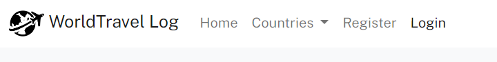

- **Navbar for registered user**

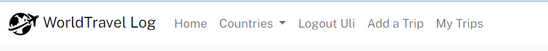

- **Navbar for admin user**

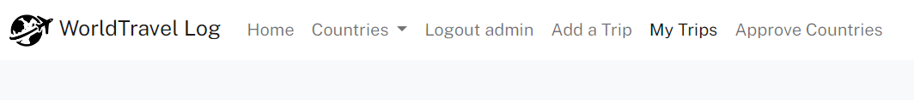

- **Navbar on mobile**

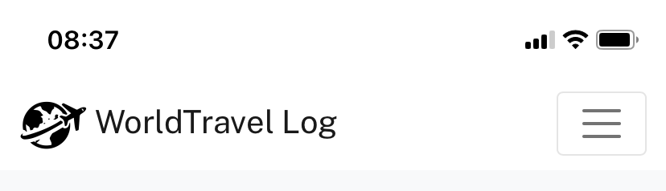

- **Navbar expanded on mobile**

- **Navbar expanded dropdown menu**

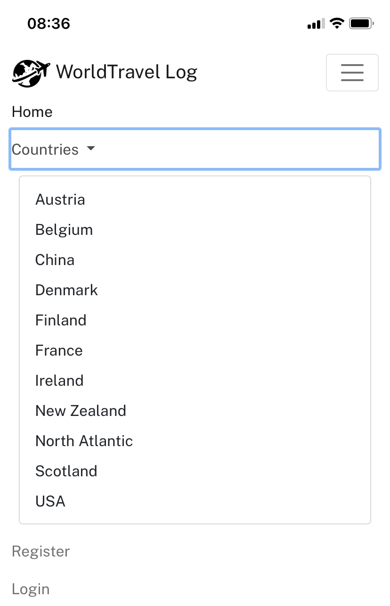

### Footer

- Footer with a slogan, links to several of the developer's pages, and a copyright feature.
- Footer is almost identical on all screen sizes.

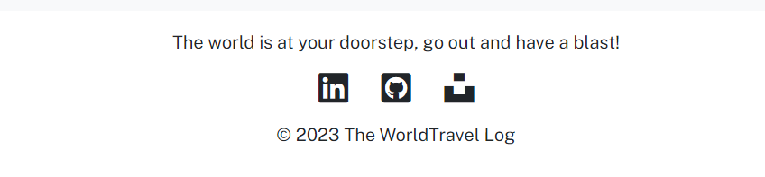

### Account Features

**Create an account**

- Allows a user to sign up
- Fields include Username, Email (optional), Password, and Password confirmation

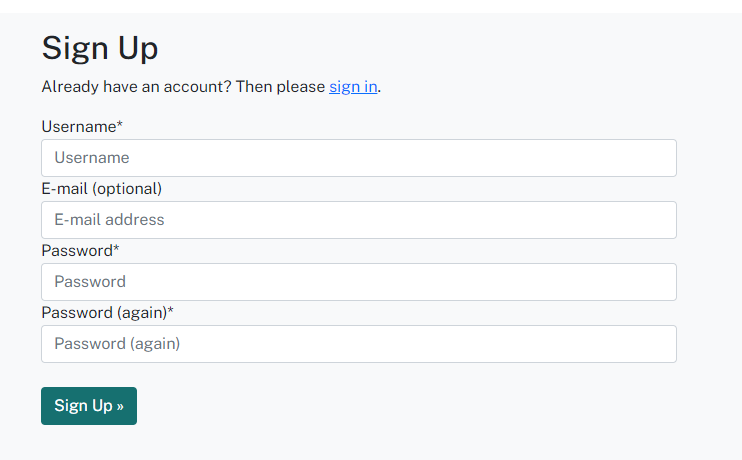

**Login to an account**

- Allows a user to access their information

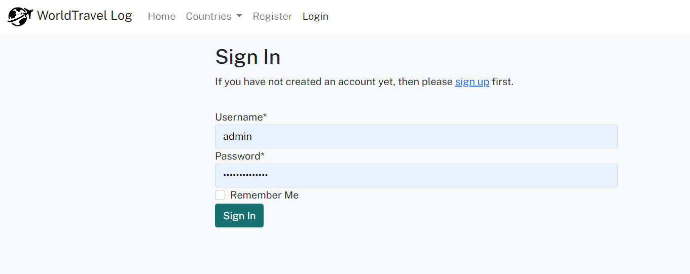

**Log out of an account**

- Allows a user to exit their account

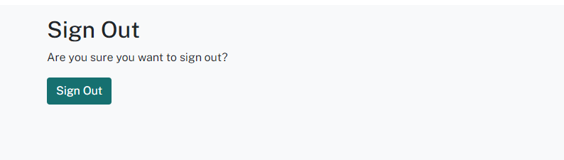

### Main Views

**Home Page**

Two distinct views for registered and unregistered users. Unregistered users see a hero image with a call to action to sign up for an account. Registered users do not see this hero image. A paginated list of publically viewable trip entry cards is displayed on the home page. Individual log entry cards feature an image, a year, and a country/location category as well as a short teaser of the trip entry.

- **Vertical Mobile View for Unregistered Users**

- **Horizontal Movile View for Unregistered Users**

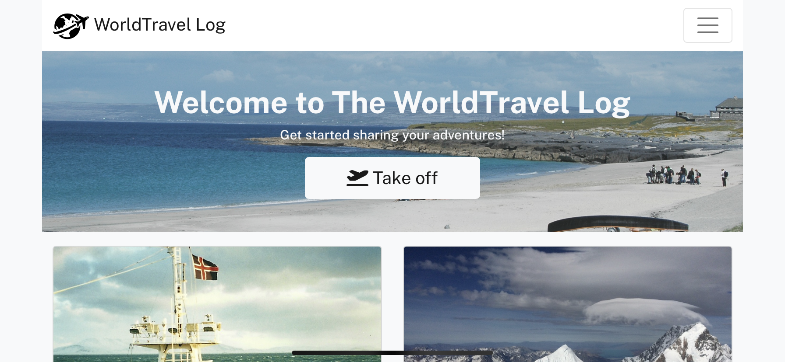

- **Desktop View of Home Page for Registered Users**

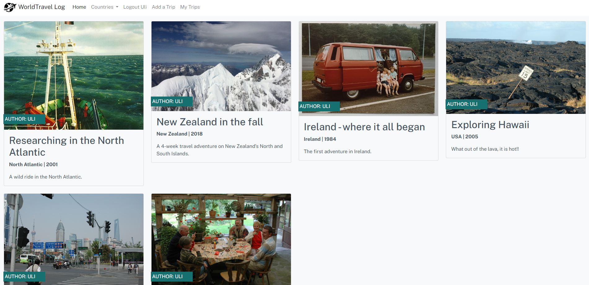

**My Log Entries**

- Allows registered users to see their log entries including those set to private and those saved as a draft.

- The log entry card for these trips will also display the status of the entry (whether it is a draft or published) and the privacy setting (whether it is viewable by the public or private):

**Countries View**

- A drop-down menu in the nav bar allows both registered and unregistered users to search the entries by country/region.
- The search will display the results. For unregistered users only publically available entries will be shown. Registered users will also see their entries if set to private.

**Log Entry Detail View**

The Log Entry Detail view allows both registered and unregistered users to view the details of a Log Entry by clicking on the title and teaser of the log entry card on the various list view pages. The title, featured image, year, and country are displayed in the header. Below the header, the description is featured followed by the image gallery associated with the entry.

Registered users will have access to buttons that allow them to update or delete an entry, a form that allows them to add more images or delete images. These features are absent on the detail view if users are not logged in or if they are not the author of the entry.

- View for Registered users with edit/delete buttons

- View for Unregistered users without the button features

### CRUD Functionality

All CRUD functionality is only available to registered users once they are logged in.

**Create a Log Entry**

Allows the user to create a log entry. The fields included in the form are a title, a country select menu, a year, a description, an optional teaser section, upload of a featured image, a published/draft choice, and a private/public choice.

**Add Images to Log Entry**

Allows the user to add a selection of images to their log entry. The fields here include a caption field and a field for keywords to provide alternative text to the image tag.

**Update a Log Entry**

Allows the user to update a log entry. The form is prefilled with all the details from the original entry.

**Delete a Log Entry**

Allow the user to delete an entry. The user will be prompted to confirm that they want to delete the entry.

**Delete an Image**

The user can delete an image by clicking on the small red wastebasket icon at the bottom of the image, which is only visible to the author of the entry if he/she is logged in. The image is immediately deleted, and the user is not asked to confirm their wish to delete the image.

**Add a country/region category**

The user can add a country category (or region) should one not be available that would fit a new entry they want to add. A link is displayed at the beginning of the 'Add Log Entry Form'. It links to a separate page with a form to be completed. The category name is then submitted for approval by the page administrator. Below the form, a list of countries currently waiting for approval is displayed.

### Success Messages

Every time a user carries out a function on the website, either as part of the account functionality or the CRUD functionality, a success message will be displayed confirming that the function was carried out successfully. Some of the messages are shown here but this is not an exhaustive list.

## Future Features

1. **List of Favorites Feature**
   Creating functionality that lets the user add individual, publically available posts to a list of favorite Log Entries which can then be displayed in a 'My Favorites' View. Implementing this would involve adding a 'Favorite' model to models.py and then creating a view and template that displays the list based on the authenticated user.

2. **Delete Account Feature**
   To give users ultimate control over their data a feature should be added that allows users to delete their account. A tutorial on how to do this can be found in this YouTube video <a href="https://www.youtube.com/watch?v=ke1IIHDwCIk">Django Update & Delete Account Tutorial</a>.

3. **Retrieve Password Feature**
   A feature to allow the user to retrieve/reset their password if they have lost/forgotten it is also quite important and should be added for a more complete user experience.

4. **Google Login**
   Allowing users to register and log in using Google would add ease of use for the user.

5. **Advanced Gallery Functionality**
   The gallery section could be improved in a variety of ways. It would be nice to be able to view the images as a gallery that allows them to be enlarged and skipped through. Also adding functionality to edit image details would be useful.

## Technologies Used

### Languages

- HTML - used as the main language to set up the structure of the website.
- CSS - used to customize the styling of the website.
- JavaScript - used to manipulate the DOM on various pages.
- Python - used to set up the core functionality of the site, such as models, and views.

### Python Modules/Packages used:

Several core packages were used, a few of the most important ones are listed here together with their functions:

- django - high-level Python web framework used to develop this application/site.
- psycopg2 - PostgreSQL database adapter for the Python programming language.
- dj3-cloudinary-storage - facilitates integration with Cloudinary by implementing Django Storage API.
- django-allauth - Integrated set of Django applications addressing authentication, registration, account management as well as 3rd party (social) account authentication.
- django-crispy-forms - provides a `crispy` filter and `` tag that allows control of the rendering behavior of Django forms in a very elegant and DRY way.
- crispy-boostrap4 - Bootstrap4 template pack for django-crispy-forms.
- coverage - allows to create a coverage report of automated testing.

### Frameworks & Tools

- Django - used to set up the back-logic and user model on the website.
- GitHub - used to host the source code of the website. Also contains the record of the Agile development framework set up to plan the project, using issues, milestones, and projects on GitHub.
- CodeAnywhere - used to write and develop the code for the website, and for committing and pushing code to GitHub.
- Heroku - used for live website deployment.
- Cloudinary - is a cloud storage solution for website media and other static files. It also allows for the manipulation and optimization of media delivery.
- Bootstrap - used throughout the site for responsiveness, layout, and predefined style elements.
- Balsamiq - used to create the project wireframes.
- Lucid Chart - used for creating the ERD and Flowchart.
- Google Fonts - used to import fonts for the website.
- Font Awesome - used for icon features on the site.
- Canva - used to generate the color scheme.

## Testing and Validation

The testing documentation can be found at [TESTING.md](TESTING.md)

## Deployment & Development

### Deploy on Heroku

**Requirement and Procfile**

Before deployment on Heroku, two files need to be created and be up to date, a `requirements.txt` file and a `Procfile`.

- The `requirements.txt` file is created by executing the following command in the terminal window: ` pip3 freeze --local > requirements.txt`. A file with all requirements will be created.
- Then create a file named `Procfile` and insert the following code: `web: gunicorn worldtravels.wsgi`, with no empty lines after it.
- Then make sure to push these files to your repository.

**Creating Heroku App**

- Log into Heroku and go to the Dashboard.
- Click "New" and then select "Create new app".
- Give your app a name and select the region closest to you.
- Click "Create app" to confirm.

**Creating a database**

- Log into ElephantSQL.com and access your dashboard.
- Click "Create New Instance"
- Set up a plan, give your plan a **Name**, select the **Tiny Turtel (Free)** plan, leave the **Tags** field blank.
- Select "Select Region" and select a data center new you.
- Click "Review".
- Confirm your details and then click "Create instance".
- Return to the ElephantSQL dashboard and click on the database instance name for this project.
- In the URL section, click the copy icon to copy the database URL.
- In your workspace make sure django and gunicorn are installed by running `pip3 install 'django<4' gunicorn`.
- Equally make sure that infrastructure for the database is installed by running `pip3 install dj_database_url===0.5.0 psycopg2`.
- Update the `requirements.txt` file if needed.

**The env.py file**

- If you do not have a `env.py` file in your workspace create one and make sure it is included in the `.gitignore` file.
- At the top of the `env.py` file add the line: `import os`.
- Below that add the following two lines:

  `os.environ["DATABASE_URL"] = "<copied URL from SQL database>"`  
  `os.environ["SECRET_KEY"] = "<create a secret key of your own>"`  

- If you are using Cloudinary storage also add the following line:  

  `os.environ["CLOUDINARY_URL"] = "<copied URL from Cloudinary account>"` 

- Make sure the environment variables are imported correctly into the `settings.py` file.
- Run `python manage.py migrate` in the terminal window to migrate the data structure to the database instance.

**Setting Environment Variables**

- On the Heroku Dashboard select the app you just created and then select the "Settings" tab.
- Click "Reveal Config Vars"
- Add the following config vars:  

  `DATABASE_URL` - copy the database URL from ElephantSQL in here, it should also be in the `env.py` file.  
  `SECRET_KEY` - copy your secret key in here.  

- If you are using Cloudinary storage you also need to copy your personal `CLOUDINARY_URL` into these fields.  
- In addition, you may need the key `PORT` with value `8000`.

**Connecting to GitHub and Deploy**

- On the Heroku Dashboard select the app you just created and then select the "Deploy" tab.
- Select GitHub for the deployment method.
- Search for the name of the project repository and click "Connect".
- Further down the page, select "Enable Automatic Deploys" if desired.
- Then finally further down, select "Deploy Branch" and watch the app being built.

### Forking the Repository

- Log in to GitHub and locate the GitHub repository you want to fork.
- At the top of the Repository above the "Settings" Tab on the menu, locate the "Fork" Button and click it.
- You will have a copy of the original repository in your GitHub account.
- You will now be able to make changes to the new version and keep the original safe.

### Making a Local Clone

- Log into GitHub and locate the repository you want to clone.
- Click the 'Code' dropdown above the file list.
- Copy the URL for the repository.
- Open Git Bash in your IDE.
- Change the current working directory to the location where you want the cloned directory.
- Type `git clone` in the CLI and then paste the URL you copied earlier. This is what it should look like:
  `$ git clone https://github.com/`
- Press Enter to create your local clone.

You will need to install all of the packages listed in the requirements file you can use the following command in the terminal `pip install -r requirements.txt` which will do it for you.

## Credits

### Media

All images added by the developer to her trip entries are owned by the developer. In addition, credit is to be given to the following parties for images used on the main site of this project:

**Images:**

- Hero image of a plane taking off at the Aron Islands is also owned by the developer.
- Default image used to display log entries without a featured image: <a href="https://unsplash.com/@amyshamblen">Amy Shamblen</a> on <a href="https://unsplash.com/photos/E2qx9Ed2qIQ">Unsplash</a>.
- Logo is taken from <a href="https://www.pngegg.com/en/png-nipeb">PNG EGG</a>.

### Code

Resources and inspiration came from a few sources:

- Especially during the initial setup of the project the Code Institute's 'I Think Therefore I Blog' Django walkthrough project was used to get started with the code.
- Several past projects were of great help and inspiration to the developer in guiding the implementation of functionality in line with the requirements of PP4 and reaching the MVP stage:
  - <a href="https://github.com/Kathrin-ddggxh/woohoo-haiku">Woohoo Haiku</a> by Kay Welfare.
  - <a href="https://github.com/paulie-o74/newsbox86">The Newsbox</a> by Paul Thomas O'Rirodan.
  - <a href="https://github.com/useriasminna/italianissimo-booking-website">Italianissimo</a> by Iasmina Pal.
- Throughout the project, the following helpful websites were often frequented for troubleshooting:
  - <a href="https://www.w3schools.com/">W3 Schools</a>
  - <a href="https://stackoverflow.com">Stack Overflow</a>
  - <a href="https://developer.mozilla.org/">mdn web docs</a>
  - <a href="https://docs.djangoproject.com/en/4.2/">Django documentation</a>

## Acknowledgements

I would like to thank:

- My mentor Brian O'Hare for his feedback, advice, guidance, and support on this and the previous three projects!
- Cohort facilitators Kay Welfare and Paul Thomas O'Rirodan, for their general advice on the management of the course, pointing us to a plethora of resources to help with the projects, and always being there to answer questions.
- The invaluable Slack community with 'the usual suspects' that have come through numerous times to help troubleshoot bugs and overcome implementation hurdles.
- The tutors at tutor support which I, surprisingly, did not need to contact much during this project (the 'Slackers' were just so on the ball!) but when I did they were always quick and efficient at resolving my issues.
- My husband, Matt, for his encouragement and support along the way.
