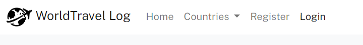
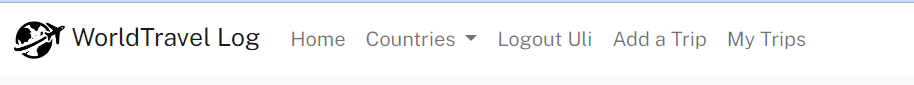
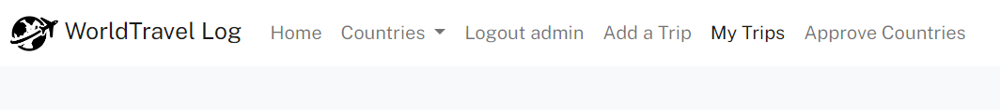
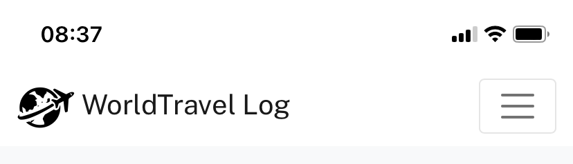
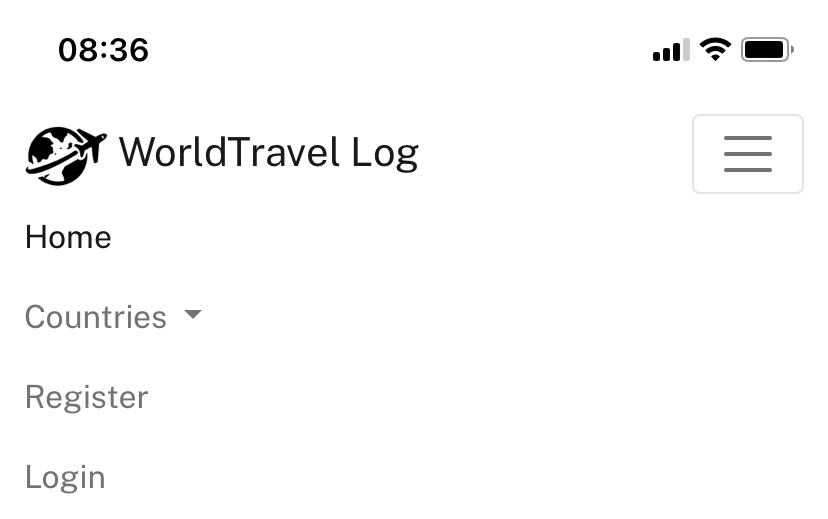
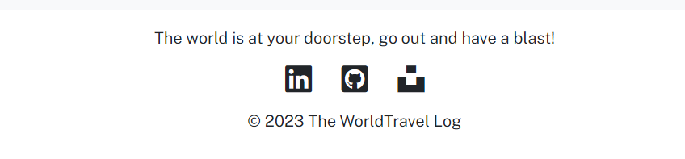

# The WorldTravel Log

(Developer: Ulrike Riemenschneider)

**Live Site:**

[Live webpage](https://worldtravellog.herokuapp.com/)

**Link to Repository:**

[Repository](https://github.com/URiem/worldtravellog)

**Developed by: Ulrike Riemenschneider**

## Table of Content

- [The WorldTravel Log](#the-worldtravel-log)
  - [Table of Content](#table-of-content)
  - [Introduction](#introduction)
    - [Project Goals](#project-goals)
    - [Data Base Design](#data-base-design)
  - [User Experience - UX](#user-experience---ux)
    - [Strategy](#strategy)
    - [Scope](#scope)
    - [Structure](#structure)
    - [Skeleton](#skeleton)
    - [Surface](#surface)
  - [Agile Development](#agile-development)
  - [Features](#features)
    - [Existing Features](#existing-features)
    - [Future Features](#possible-future-features)
  - [Technologies Used](#technologies-used)
    - [Languages](#languages)
    - [Python Modules \& Packages](#python-modulespackages-used)
    - [Frameworks \& Tools](#frameworks--tools)
    - [Helpful sites](#helpful-sites)
  - [Testing and Validation](#testing-and-validation)
  - [Deployment \& Development](#deployment--development)
  - [Credits](#credits)
    - [Media](#media)
    - [Code](#code)
  - [Acknowledgements](#acknowledgements)

## Introduction

The WorldTravel Log is a website that is designed to allow users to upload and keep track of information on travels they have undertaken. Each 'Travel Log Entry' contains information on one particular trip and the user can then opt to add additional images to the log of each particular trip. Users can set up accounts which allows them to add, edit and delete entries as well as images associated with each entry. Users can also choose to give an entry a privacy setting so that only they will be able to view it and it will not be shared for all users to see.

The project was desiged as the 4th portfolio project of the Code Institutes Full Stack Diploma Program. It was built using Django, Python, JS, CSS and HTML. The data are stored in a PostgeSQL database.

### Project Goals

The goal of the project was to build a tool for users to create a repository of memories from travels so that they may share them with others, privately or publically, or use them like a small photo diary of experiences. Each travel log can be populated with a small gallery of pictures from memorable moments of the adventures. So often images from travel experiences sit in file structures on private computers and are seldom looked at. If shared on common social media site, they disappear in a long, long timeline of social media posts that are difficult to search for or retrieve in the future. This site allows users to create log entries focusing on a specific trip, with a short description and defining information, such as the country of travel, the year and a descriptive title. The log entries can be edited and deleted by the user who created them. To protect their privacy, users can choose to publically share a log entry or keep it private.

### Data Base Design

The Entity Relationship Diagram (ERD) illustrates the structure of the data base which lies at the core of the functionality of the site:

A User Model is provided by Django, a Logentry Model stores the details of each Triplog that a user adds, a user can add many log entries. An Image Model allows the user to add and store images specific to each Triplog, each Log can have multiple pictures associated with it. In addition a Country Model allows the user to categorize their entries by country of travel, which then makes the log entries searchable to the user.

## User Experience - UX

The application was developed taking the Five Planes of User Experience into consideration:

### Strategy

| EPIC                       | ID  | User Story                                                                                                                                                                                        |
| -------------------------- | --- | ------------------------------------------------------------------------------------------------------------------------------------------------------------------------------------------------- |
| **CONTENT AND NAVIGATION** |     |                                                                                                                                                                                                   |
|                            | 1A  | As a user, I want to see a navigation menu so I can easily movement through the site.                                                                                                             |
|                            | 1B  | As a user, I want to see relevant information about the site and its content easily so I can decide if I want to register an account                                                              |
|                            | 1C  | As a user, I want to see an intitive and visualy pleasing design that matches the intent of the website.                                                                                          |
|                            | 1D  | As a user, I can access different pages on the site, so that I can navigate smoothy through all the functionality of the site.                                                                    |
| **REGISTRATION AND USER**  |     |                                                                                                                                                                                                   |
|                            | 2A  | As a user, I want to be able to register a profile, so I can access the main functionality of the site.                                                                                           |
|                            | 2B  | As a user, I want to be able to log into my account easily, so I can access my account information.                                                                                               |
|                            | 2C  | As a user, I want to be able to logout of my account with ease to protect my account information.                                                                                                 |
|                            | 2D  | As a user, I want to be able to delete my account information or request account deletion from the website owner.                                                                                 |
| **MANAGING LOG ENTRIES**   |     |                                                                                                                                                                                                   |
|                            | 3A  | As an authenticated user, I want to be able to add a log entry and choose privacy and draft/publish setting, so that I can create a trip log that displays as specified on the site.              |
|                            | 3B  | As an authenticated user, I want to be able to edit and delete my log entries so that I can customize as I see fit.                                                                               |
|                            | 3C  | As an authenticated user, I want to be able to add images to individual log entries so that I can customize the log entry with this added feature.                                                |
|                            | 3D  | As an authenticated user, I want to be able to edit and delete the images associated with a particular log entry so that I can customize individual entries.                                      |
| **USER VIEWS**             |     |                                                                                                                                                                                                   |
|                            | 4A  | As a user, I want to be able to see all publically available log entries so that I can browse through them.                                                                                       |
|                            | 4B  | As a user, I want to be able to view the detail of all publically available log entries, so I can learn details about the trip entry.                                                             |
|                            | 4C  | As a user, I want to be able to search the log entries by country, in order to see various trips associated with that country.                                                                    |
|                            | 4D  | As an authenticated user, I want to be able to view all my personal entries including the current settings on privacy and published/draft status so that I can get a quick overview of my entries |
|                            | 4E  | As an authenticated user, I want to be able to select and save favorite log entries, so that I can save them and view them in a separate page.                                                    |
|                            | 4F  | As an authenticated user, I want to see feedback on my interactions with the site functionality, so that I can confirm my intended action was executed correctly.                                 |

#### Target Audience

The target audience is user who enjoy travelling and would like to record their experiences and impressions in succint form online in order to share them with the wider public or privately for they own future enjoyment.

#### User Requirements and Expectations

- Simple and intuitive navigation system and design.
- Easy access to all functionality of the site.
- All links and features work as expected.
- Immediate feedback on progress during interaction with site features.
- Visually appealing responsive design.
- Accessibility.

### Scope

**Simple and intuitive User Experience**

- Ensure navigation menu is easily accessible and functions as expected.
- Ensure page names match the intended content.
- Ensure the user gets visual feedback when navigating through the sites functionalities.
- Create a design that matches the intent of the page.

**Relevant content**

- Add information about the site's purpose to make its intent clear to the user.
- Feature user created content on the front page that help the new user understand the purpose of the site.

**Core Website Functionality**

- Implement a Log Entry Features that allow the user to interact with the site.
- Implement the registration/login/logout features for access to core site functionality.
- Implement a form for adding an entry to the log.
- Implement a feature to edit and delete a log entry.
- Implement a feature that allows the user to add/edit/delete images to a log entry.

**Responsiveness**

- Implement responsive design for smooth desktop, tablet and mobile device access.

### Structure

The website is divided into XXX pages with content depending on whether the user is authenticated or not.

#### Current/Initial Structure

- **Home Page** is visible to both types of users. It includes a list of publically shared trip logs for the user to browse. Unauthenticated users will also see a banner calling them to register, authenticated users will not see the banner.
- **Register Page** gives the user the opportunity to create an account in order to access the core functionality of the site.
- **Login/Logut Pages** allow the user to authenticate or logout of their account.
- **Add Log Entry Page** allows an authenticated user to add a logentry to their account.
- **User Entries Page** allows authenticated user to see all their logs including those with the private setting and those that have not yet been published and are just saved as a draft.
- **Log Entry Detail Page** allows the user to view all the details of a trip log, if they are authenticated and it is their own post they will see buttons that allow to access the edit or delete features. They will also see a feature for adding/editing/deleting images associated with the log entry.
- **Update Log Entry Page** displays a prepopulated entry log form and allows the user to edit their previous inputs.

#### Yet to be implemented/future pages

- **Favorite Entries Page** allows a user to select/save and display their favorite log entries from all publically published posts.

**Add a flowchart illustrating user navigation through the site.**

### Skeleton

#### Wireframes

The wireframes for the pages listed in the above [Structure](#structure) section follow:

1. **Home Page**

2. **Logentry Detail Page**

3. **My Trips View**

4. **Add a Log Entry View**

5. **Sign Up View**

6. **404 Page** - a simple 404 Error page is also included (404.html)

### Surface

#### Color Scheme

#### Font

## Agile Development

All functionality and development of this project was managed through GitHub issues, milestones and projects.

### Sprints

- Sprint 1: Initial Set-up - May 25th, 2023 to June 1st, 2023

  - Setup CI template
  - Create the project and app
  - Install packages: django, dj_database, psyocpg2, cloudinary-storage, etc.
  - Update/create project files: settings.py, env.py, Procfile
  - Migrate changes
  - Setup database
  - Create a base.html

- Sprint 2: LogEntry feature and user authentication - June 1st, 2023 to June 5th, 2023

  - Setup database models
  - Import static files for layout, css, js, images
  - Create an index.html and view
  - Add a view for the main LogEntry model
  - Create a detail view of the LogEntry model
  - Install allauth and crispy-forms
  - Add allauth templates to workspace
  - Link up the login, logout, and signup templates to base.html
  - Add css styling to authorization pages
  - Setup a README file with basic layout
  - Change materialize to bootstrap styling
  - Install crispy-bootstrap4
  - Add introduction to README

- Sprint 3: Customized views and README - June 6th, 2023 to June 17th, 2023

  - Add ERD and goal section to README
  - Add form and view to upload image to logentry_details page
  - Add form and view to update and delete Log Entries.
  - Add a privacy filter to index.html to display only public entries
  - Add UserLogentry view including private entries for authenticated users
  - Style image gallery
  - Add delete image functionality
  - Add content to README: UX, Deployment and Development
  - Create separate TESTING file with layout

- Sprint 4: Refine and customize the CSS including footer and header - June 17th, 2023 to present

  - Style banner, add call to action to banner
  - Style header and footer
  - Add and finalize display of success-messages

  - MVP reached

- Sprint 5: Testing

- Sprint 6: Final revisions to code and documentation

## Features

### Existing Features

#### Header and Navigation

- Navbar with logo, pagename and links
- Different links are visible for unauthenticated users, authenticated users and the admin user
- Active links are rendered in black as opposed to the default grey
- On small to medium screen the navigation links are displayed as a collapsible burger menu
- A dropdown menu for country categories is available on all screen sizes

<!--  -->

**Navbar for unregistered user**

**Navbar for registered user**

**Navbar for admin user**

**Navbar on mobile**

**Navbar expanded on mobile**

**Navbar expanded dropdown menu**

#### Footer

- Footer with a slogan, links to several of the developers pages and a copyright feature
- Footer is almost identical on all screen sizes.

#### Account Features

**Create an account**

- Allows a user to sign up
- Fields include Username, Email (optional), Password and Password confirmation

**Login to an account**

- Allows a user to access their information

**Log out of an account**

- Allows a user to exit their account

#### Main Views

**Home Page**

- Two distinct views for a registered and unregistered user
- Unregistered user see a hero image with a call to action to sign up for an account
- Registered user do not see this hero image
- A paginated list of publically viewable trip entry cards is displayed on the home page
- Individual log entry cards feature an image, a year and country/location category as well as a short teaser of the trip entry

**My Log Entries**

- Allows registered users to see their personal log entries including those set to private
- The log entry card for these trips will also display the status of the entry (whether it is a draft or published) and the privacy setting (whether it is viewable by the public or private)

**Countries View**

- A dropdown menu in the nav bar allows both registered and unregistered users to search the entries by country/region.
- The search will display the results. For uregistered users only publically available entries will be show. Registered users will also see their own entries if set to private.

#### CRUD Functionality

All CRUD functionality is only available to registered users once they are logged in.

**Create a Log Entry**

**Add Images to Log Entry**

**Update a Log Entry**

**Delete a Log Entry**

**Delete an Image**

**Add a country/region category**

#### Success Messages

Every time a user carries out a function on the website, either as part of the account functionality or the CRUD functionality, a success message will be displayed confirm that the function as been carried our successfully.

### Future Features

**List of Favorites Feature**
Creating functionality that lets the user add individual, publically available posts to a list of favorite Log Entries which can then be displayed in a 'My Favorites' View. Implementing this would involve adding a 'Favorite' model to models.py and then create a view and template that displays the list based on the authenticated user.

**Delete Acccount Feature**
To give users ultimate control over their data a feature should be added that allows users to delete their account. A tutorial on how to do this can be found in this YouTube video <a href="https://www.youtube.com/watch?v=ke1IIHDwCIk">Django Update & Delete Account Tutorial</a>.

**Retrieve Password Feature**
A feature to allow the user to retrieve/reset their password if they have lost/forgotten it, is also quite important and should be added for a more complete user experience.

## Technologies Used

### Languages

- HTML - used at the main language to set up the structure of the website.
- CSS - used to customize the styling of the website.
- JavaScript - used to manipulate the DOM on various pages.
- Python - used to set up the core functionality of the site, such as models, and views.

### Python Modules/Packages used:

- django
- gunicorn
- dj-database-url
- psycopg2
- dj3-cloudinary-storage
- django-allauth
- django-crispy-forms
- and more ...

### Frameworks & Tools

- Django - used to set up the back-logic and user model on the website.
- GitHub - used to host the source code of the website. Also contains the record of the Agile development framework set up to plan the project, using issues, milestone and projects on GitHub.
- CodeAnywhere - used write and develope the code for the website, and for comitting and pushing code to GitHub.
- Heroku - used for live website deployment.
- Cloudinary - is a cloud storage solution for website media and other static files. It also allows for manipulation and optimization of media delivery.
- Bootstrap - used throughout the site for responsiveness, layout and predifined styles elements.
- Balsamiq - used to create the project wireframes.
- Lucid Chart - used for creating the ERD and Flowchart.
- Google Fonts - used to import fonts for the website.
- Font Awesome - used for icons features on the site.

### Helpful sites

Several sites came in handy while developing the code to help with problem solving:

- <a href="https://www.w3schools.com/">W3 Schools</a>
- <a href="https://stackoverflow.com">Stack Overflow</a>
- <a href="https://developer.mozilla.org/">mdn web docs</a>

## Testing and Validation

The testing documentation can be found at [TESTING.md](TESTING.md)

## Deployment & Development

### Deploy on Heroku

**Requirement and Procfile**

Before depolyment on Heroku, two files need to be created and be up to date, a `requirements.txt` file and a `Procfile`.

- The `requirements.txt` file is created by executing the following command in the terminal window: ` pip3 freeze --local > requirements.txt`. A file with all requirements will be created.
- Then create a file named `Procfile` and insert the following code: `web: gunicorn worldtravels.wsgi`, with no empty lines after it.
- Then make sure to push these files to your repository.

**Creating Heroku App**

- Log into Heroku and go to the Dashboard.
- Click "New" and then select "Create new app".
- Give your app a name and select the region closest to you.
- Click "Create app" to confirm.

**Creating a database**

- Log into ElephantSQL.com and access your dashboard.
- Click "Create New Instance"
- Set up a plan, give your plan a **Name**, select the **Tiny Turtel (Free)** plan, leave the **Tags** field blank.
- Select "Select Retion" and select a data center new you.
- Click "Review".
- Confirm your details and then click "Create instance".
- Return to the ElephantSQL dashboard and click on the database instance name for this project.
- In the URL section, click the copy icon to copy the database URL.
- In your workspace make sure django and gunicorn are installed by running `pip3 install 'django<4' gunicorn`.
- Equally make sure that infrastructure for the data base is installe by running `pip3 install dj_database_url===0.5.0 psycopg2`.
- Update the `requirements.txt` file if needed.

**The env.py file**

- If you do not have a `env.py` file in your workspace create one and make sure it is included in the `.gitignore` file.
- At the top of the `env.py` file add the line: `import os`.
- Below that add the following two lines:

  `os.environ["DATABASE_URL"] = "<copied URL from SQL database>"`  
  `os.environ["SECRET_KEY"] = "<create a secret key of your own>"`  

- If you are using Cloudinary storage also add the following line:  

  `os.environ["CLOUDINARY_URL"] = "<copied URL from Cloudinary account>"` 

- Make sure the environment variable are imported correctly into the `settings.py` file.
- Run `python manage.py migrate` in the terminal window to migrate the data structure to the database instance.

**Setting Environment Variables**

- On the Heroku Dashboard select the app you just created and then select the "Settings" tab.
- Click "Reveal Config Vars"
- Add the following config vars:  

  `DATABASE_URL` - copy the data base URL from ElephantSQL in here, it should also be in the `env.py` file.  
  `SECRET_KEY` - copy your secret key in here.  

- If you are using Cloudinary storage you also need to copy your personal `CLOUDINARY_URL` into these fields.  
- In addition you may need the key `PORT` with value `8000`.

**Connecting to GitHub and Deploy**

- On the Heroku Dashboard select the app you just created and then select the "Deploy" tab.
- Select GitHub for deployment method.
- Search for the name of the project repository and click "Connect".
- Further down the page, select "Enable Automatic Deploys" if desired.
- Then finally further down, select "Deploy Branch" and watch the app being built.

### Forking the Repository

- Log in to GitHub and locate the GitHub repository you want to fork.
- At the top of the Repository above the "Settings" Tab on the menu, locate the "Fork" Button and click it.
- You will have a copy of the original repository in your GitHub account.
- You will now be able to make changes to the new version and keep the original safe.

### Making a Local Clone

- Log into GitHub and locate the repository you want to clone.
- Click the 'Code' dropdown above the file list.
- Copy the URL for the repository.
- Open Git Bash in your IDE.
- Change the current working directory to the location where you want the cloned directory.
- Type `git clone` in the CLI and then paste the URL you copied earlier. This is what it should look like:
  `$ git clone https://github.com/`
- Press Enter to create your local clone.

You will need to install all of the packages listed in the requirements file you can use the following command in the terminal `pip install -r requirements.txt` which will do it for you.

## Credits

### Media

Images not referenced below are owned by the developer.

Images:

- Background image by <a href="https://unsplash.com/@drwmrk">Andrew Stutesman</a> on <a href="https://unsplash.com/photos/l68Z6eF2peA">Unsplash</a>

### Code

Resources and inspiration came from a few sources:

Django Image Gallery Website Step by Step Tutorial <https://www.youtube.com/watch?v=eOM4e6N7fuc>

## Acknowledgements

I would like to thank:

- My mentor Brian O'Hare for his feedback, advice, guidance and support.
- Cohort fascilitator Paul Thomas O'Rirodan, for his general advice on the management of the course and pointing us to a plethora of resources to help with the projects.
- My husband, Matt, for his encouragement and support along the way.
