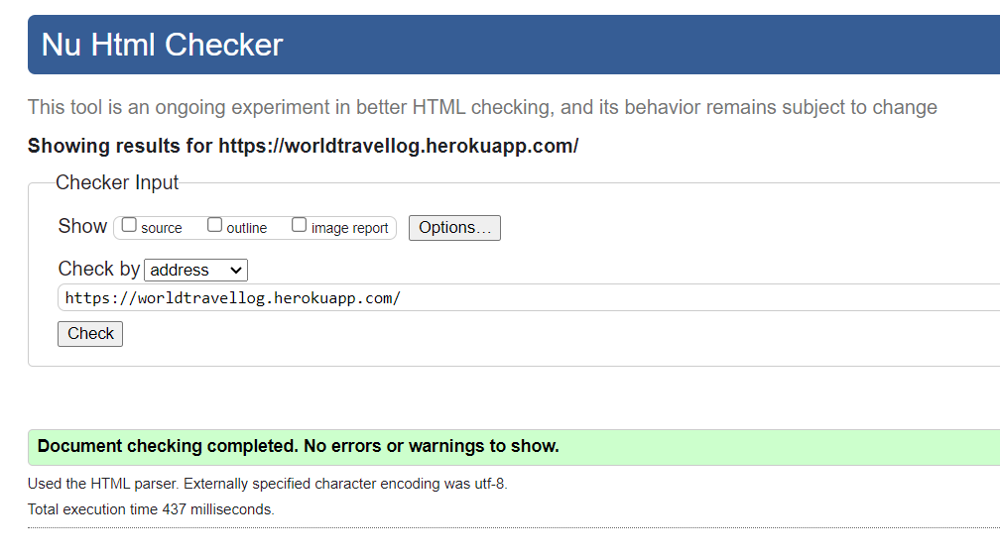
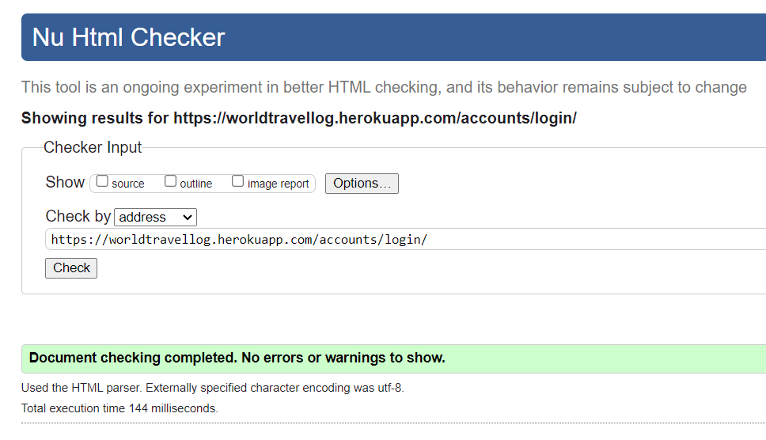
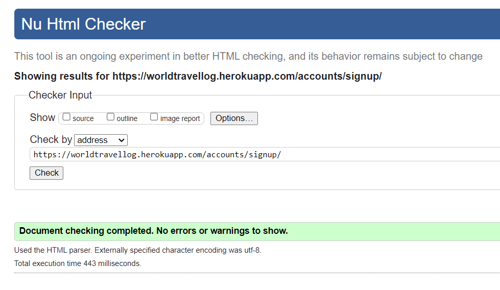
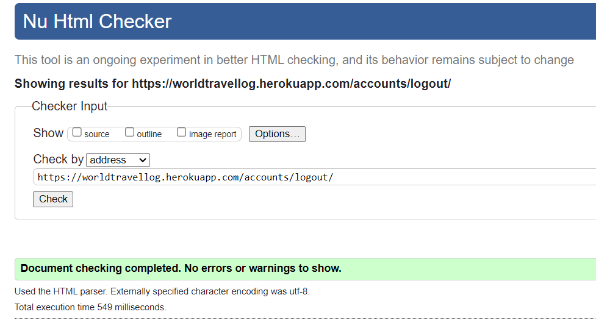
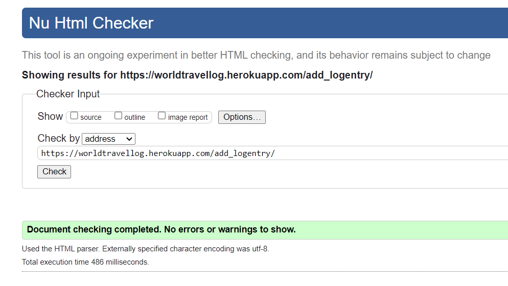
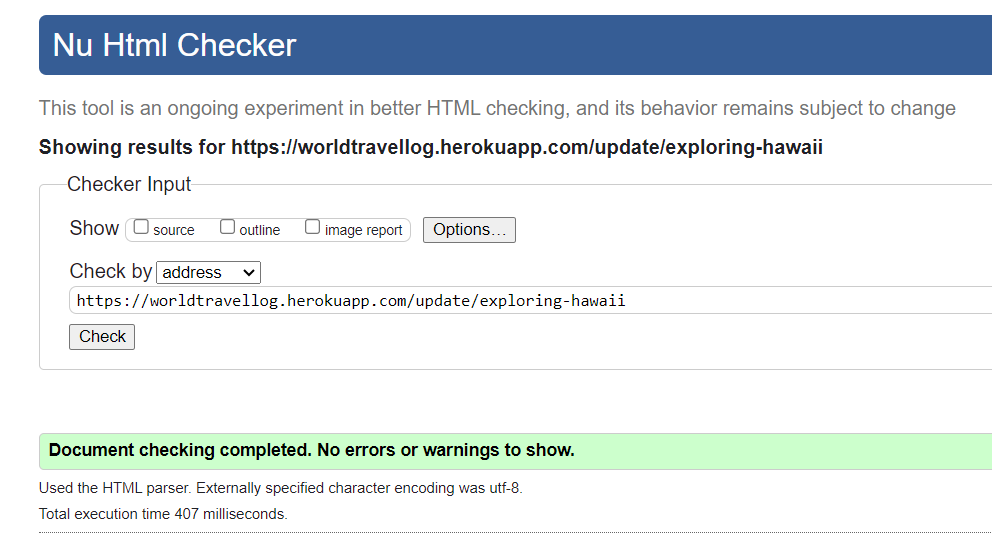
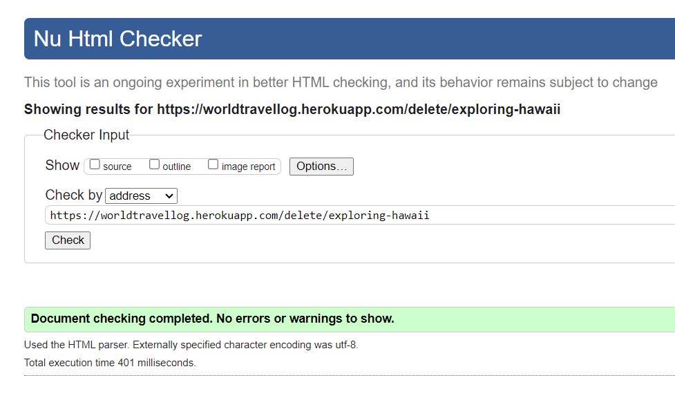
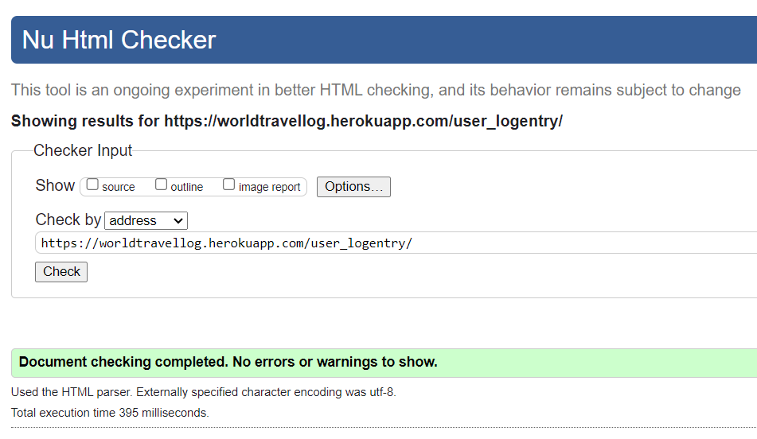
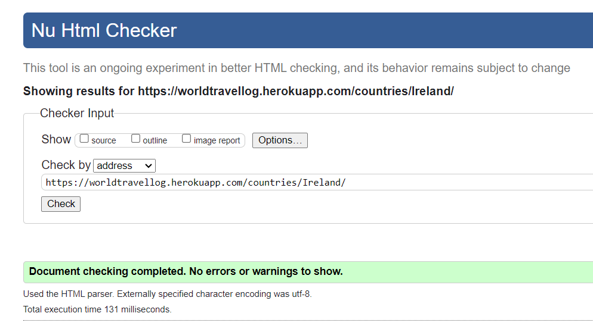

# The WorldTravel Log Testing

:arrow_left: [Return to the README](README.md)

## Table of Contents

- [Performance](#performance)
  - [Google's Lighthouse Performance](#googles-lighthouse-performance)
- [Accessibility](#accessibility)
  - [Accessibility Validation](#accessibility-validation)
- [Code Validation](#code-validation)
  - [HTML Validation](#html-validation)
  - [CSS Validation](#css-validation)
  - [JS Validation](#js-validation)
  - [PEP8 Validation](#pep8-validation)
- [Testing](#testing)
  - [Manual Testing](#manual-testing-bdd)
  - [Automated View Testing](#automated-view-testing)
- [Browser Testing](#browser-testing)
- [Bugs & Fixes](#bugs-and-fixes)

# Performance

## Google Lighthouse Performance

[Google Lighthouse](#) was used to test the performance of the website.

# Accessibility

Results from Wave

## Accessibility Validation

The [WAVE WebAIM web accessibility evaluation tool](https://wave.webaim.org/) was used to ensure the website met high accessibility standards.

# Code Validation

## HTML Validation

The [W3C Markup Validation Service](https://validator.w3.org/) was used to validate the HTML of the website.

**HTML results:**

No errors were detected on any of the pages tested.

Home page

  

Log Entry Detail page

  

Login page

  

Sign Up page

  

Logout page

  

Add Logentry page

  

Update Logentry page

  

Delete Logentry page

  

User Entries page

  

Countries page

  

## CSS Validation

The [W3C Jigsaw CSS Validation Service](https://jigsaw.w3.org/css-validator/) was used to validate the CSS of the website.

## JS Validation

[JSHint](https://jshint.com/) was used to validate the JavaScript/Jquery of the website.

## PEP8 Validation

# Testing

## Manual Testing

BDD, or Behaviour Driven Development, is the process used to test user stories in a non-technical way, allowing anyone to test the features of an app.

## Automated View Testing

https://github.com/useriasminna/italianissimo-booking-website/blob/main/booking/tests.py
https://www.valentinog.com/blog/testing-modelform/
https://developer.mozilla.org/en-US/docs/Learn/Server-side/Django/Testing
https://github.com/cloudinary/pycloudinary/blob/master/django_tests/test_cloudinaryField.py
https://stackoverflow.com/questions/26298821/django-testing-model-with-imagefield#26307916
https://cferreirasuazo.medium.com/lets-unit-test-django-forms-280704168d1b

**Travel Log Testing**

# Browser Testing

- Chrome
- Edge
- Safari
- Waterfox

# Bugs and Fixes

:arrow_left: [Return to the README](README.md)
