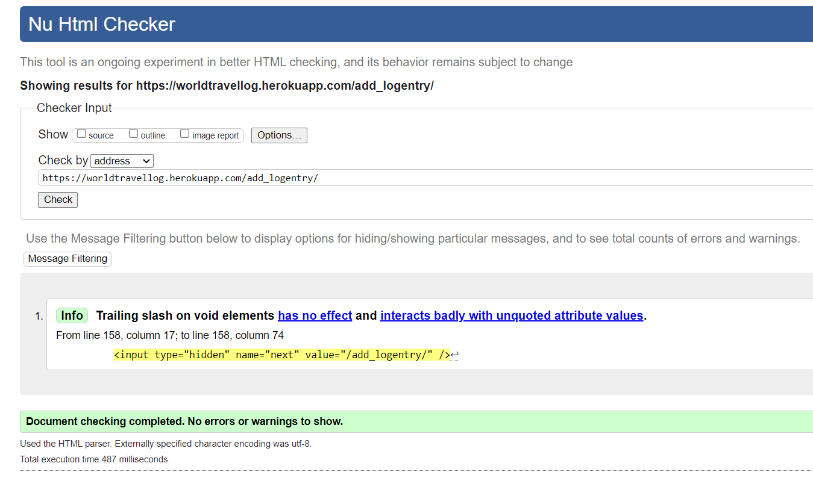

# The WorldTravel Log Testing

:arrow_left: [Return to the README](README.md)

## Table of Contents

- [Performance](#performance)
- [Accessibility](#accessibility)
- [Code Validation](#code-validation)
  - [HTML Validation](#html-validation)
  - [CSS Validation](#css-validation)
  - [JS Validation](#js-validation)
  - [PEP8 Validation](#python-code-validation)
- [Testing](#testing)
  - [Manual Testing](#manual-testing)
  - [Automated Testing](#automated-testing)
- [Browser Testing](#browser-testing)
- [Bugs & Fixes](#bugs-and-fixes)

# Performance

[Google Lighthouse](https://developer.chrome.com/docs/lighthouse/overview/) was used to test the performance of the website.

Desktop

- Home page

  

- Entry Detail page

  

Mobile

- Home page

  

- Entry Detail page

  

# Accessibility

The [WAVE WebAIM web accessibility evaluation tool](https://wave.webaim.org/) was used to ensure the website met high accessibility standards.

**Wave results:**

Home page

# Code Validation

## HTML Validation

The [W3C Markup Validation Service](https://validator.w3.org/) was used to validate the HTML of the website.

**HTML results:**

The following pages where tested and no errors were detected on any of the pages.

Home page

Log Entry Detail page

Login page

Sign Up page

Logout page

Add Logentry page

Update Logentry page

Delete Logentry page

User Entries page

Countries page

## CSS Validation

The [W3C Jigsaw CSS Validation Service](https://jigsaw.w3.org/css-validator/) was used to validate the CSS of the website.

The testing of the `style.css` file resulted in the following outcome:

## JS Validation

[JSHint](https://jshint.com/) was used to validate the JavaScript/Jquery of the website.

## Python Code Validation

The python code was tested using the [CI Python Linter](https://pep8ci.herokuapp.com/).

**Python testing results Travellog App:**

models.py

views.py

forms.py

urls.py

apps.py

admin.py

**Python testing results of Worldtravels Files:**

views.py

asgi.py

wsgi.py

urls.py

# Testing

## Manual Testing

BDD, or Behaviour Driven Development, is the process used to test user stories in a non-technical way, allowing anyone to test the features of an app.

**EPIC: Content and navigation**
| ID | User Story | Action/Expected Results | Pass |
| -- | ---------- | ----------------------- | ---- |
| 1A | As a user, I want to see a navigation menu so I can easily movement through the site. | A user accessing any page on the site will see a navigation bar in the header with links to the core pages of the site. Click on a desired link and a new page opens. On a mobile devise or other small screens a burger menu can be clicked and the menu will appear. | :white_check_mark: |
| 1B | As a user, I want to see relevant information about the site and its content easily so I can decide if I want to register an account | For unregistered users who access the home page a hero image and banner with a call to action succinctly invokes the purpose of the site. Trip entries displayed in a list below the hero image illustrate the purpose. | :white_check_mark: |
| 1C | As a user, I want to see an intuitive and visualy pleasing design that matches the intent of the website. | Access any of the core pages of the site. They will display a list of relevant log entries in uncluttered and clear styling, illustrating the intent of the page. | :white_check_mark: |
| 1D | As a user, I can access different pages on the site, so that I can navigate smoothy through all the functionality of the site. | Any user can scroll to the top of any page to access the header. In the header clear navigation options are displayed to the core pages of the site. | :white_check_mark: |

**EPIC: REGISTRATION AND USER**
| ID | User Story | Action/Expected Results | Pass |
| -- | ---------- | ----------------------- | ---- |
| 2A | As a user, I want to be able to register a profile, so I can access the main functionality of the site. | Here is what I do to make this happen | :white_check_mark: |
| 2B | As a user, I want to be able to log into my account easily, so I can access my account information. |Here is what I do to make this happen | :white_check_mark: |
| 2C | As a user, I want to be able to logout of my account with ease to protect my account information. | Here is what I do to make this happen | :white_check_mark: |
| 2D | As a user, I want to be able to delete my account information or request account deletion from the website owner. | Here is what I do to make this happen | :white_check_mark: |

**EPIC: MANAGING LOG ENTRIES**
| ID | User Story | Action/Expected Results | Pass |
| -- | ---------- | ----------------------- | ---- |
| 3A | As an authenticated user, I want to be able to add a log entry and choose privacy and draft/publish setting, so that I can create a trip log that displays as specified on the site. | Here is what I do to make this happen | :white_check_mark: |
| 3B | As an authenticated user, I want to be able to edit and delete my log entries so that I can customize as I see fit. | Here is what I do to make this happen | :white_check_mark: |
| 3C | As an authenticated user, I want to be able to add images to individual log entries so that I can customize the log entry with this added feature. | Here is what I do to make this happen | :white_check_mark: |
| 3D | As an authenticated user, I want to be able to delete the images associated with a particular log entry so that I can customize individual entries. | Here is what I do to make this happen | :white_check_mark: |

**EPIC: USER VIEWS**
| ID | User Story | Action/Expected Results | Pass |
| -- | ---------- | ----------------------- | ---- |
| 4A | As a user, I want to be able to see all publically available log entries so that I can browse through them. | Here is what I do to make this happen | :white_check_mark: |
| 4B | As a user, I want to be able to view the detail of all publically available log entries, so I can learn details about the trip entry. | Here is what I do to make this happen | :white_check_mark: |
| 4C | As a user, I want to be able to search the log entries by country, in order to see various trips associated with that country. | Here is what I do to make this happen | :white_check_mark: |
| 4D | As an authenticated user, I want to be able to view all my personal entries including the current settings on privacy and published/draft status so that I can get a quick overview of my entries | Here is what I do to make this happen | :white_check_mark: |
| 4E | As an authenticated user, I want to see feedback on my interactions with the site functionality, so that I can confirm my intended action was executed correctly. | Here is what I do to make this happen | :white_check_mark: |

## Automated Testing

Based on testing guidance and instruction on the Code Institute LMS 'Hello Django' walkthrough some automated testing for the project was carried out. Three separate files where used `test_models.py` to test some aspects of the models, `test_views.py` to test aspects of the views, and `test_forms.py` to test the forms.

In addition the following website were used for guidance and trouble shooting on how to implement the automated testing:

- https://developer.mozilla.org/en-US/docs/Learn/Server-side/Django/Testing
- https://www.valentinog.com/blog/testing-modelform/
- https://cferreirasuazo.medium.com/lets-unit-test-django-forms-280704168d1b
- https://github.com/cloudinary/pycloudinary/blob/master/django_tests/test_cloudinaryField.py
- https://stackoverflow.com/questions/26298821/django-testing-model-with-imagefield#26307916
- https://github.com/useriasminna/italianissimo-booking-website/blob/main/booking/tests.py

**Testing results:**

- **test_models.py**

- **test_views.py**

- **test_forms.py**

**Testing coverage:**

A coverage report was generated to determine the percentage of code tested:

# Browser Testing

The application was tested on the following browsers and worked without issues:

- Chrome
- Edge
- Safari
- Waterfox

# Bugs and Fixes

:arrow_left: [Return to the README](README.md)
