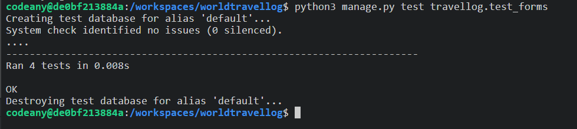

# The WorldTravel Log Testing

:arrow_left: [Return to the README](README.md)

## Table of Contents

- [Performance](#performance)
- [Accessibility](#accessibility)
- [Code Validation](#code-validation)
  - [HTML Validation](#html-validation)
  - [CSS Validation](#css-validation)
  - [JS Validation](#js-validation)
  - [PEP8 Validation](#python-code-validation)
- [Testing](#testing)
  - [Manual Testing](#manual-testing-bdd)
  - [Automated Testing](#automated-testing)
- [Browser Testing](#browser-testing)
- [Bugs & Fixes](#bugs-and-fixes)

# Performance

[Google Lighthouse](https://developer.chrome.com/docs/lighthouse/overview/) was used to test the performance of the website.

Desktop

- Home page

  

- Entry Detail page

  

Mobile

- Home page

  

- Entry Detail page

  

# Accessibility

The [WAVE WebAIM web accessibility evaluation tool](https://wave.webaim.org/) was used to ensure the website met high accessibility standards.

**Wave results:**

Home page

# Code Validation

## HTML Validation

The [W3C Markup Validation Service](https://validator.w3.org/) was used to validate the HTML of the website.

**HTML results:**

The following pages where tested and no errors were detected on any of the pages.

Home page

Log Entry Detail page

Login page

Sign Up page

Logout page

Add Logentry page

Update Logentry page

Delete Logentry page

User Entries page

Countries page

## CSS Validation

The [W3C Jigsaw CSS Validation Service](https://jigsaw.w3.org/css-validator/) was used to validate the CSS of the website.

The testing of the `style.css` file resulted in the following outcome:

## JS Validation

[JSHint](https://jshint.com/) was used to validate the JavaScript/Jquery of the website.

## Python Code Validation

The python code was tested using the [CI Python Linter](https://pep8ci.herokuapp.com/).

**Python testing results Travellog App:**

models.py

views.py

forms.py

urls.py

apps.py

admin.py

**Python testing results of Worldtravels Files:**

views.py

asgi.py

wsgi.py

urls.py

# Testing

## Manual Testing

BDD, or Behaviour Driven Development, is the process used to test user stories in a non-technical way, allowing anyone to test the features of an app.

## Automated Testing

Based on testing guidance and instruction on the Code Institute LMS 'Hello Django' walkthrough some automated testing for the project was carried out. Three separate files where used `test_models.py` to test some aspects of the models, `test_views.py` to test aspects of the views, and `test_forms.py` to test the forms.

In addition the following website were used for guidance and trouble shooting on how to implement the automated testing:

- https://developer.mozilla.org/en-US/docs/Learn/Server-side/Django/Testing
- https://www.valentinog.com/blog/testing-modelform/
- https://cferreirasuazo.medium.com/lets-unit-test-django-forms-280704168d1b
- https://github.com/cloudinary/pycloudinary/blob/master/django_tests/test_cloudinaryField.py
- https://stackoverflow.com/questions/26298821/django-testing-model-with-imagefield#26307916
- https://github.com/useriasminna/italianissimo-booking-website/blob/main/booking/tests.py

**Testing results:**

- **test_models.py**

- **test_views.py**

- **test_forms.py**

**Testing coverage:**

A coverage report was generated to determine the percentage of code tested:

# Browser Testing

- Chrome
- Edge
- Safari
- Waterfox

# Bugs and Fixes

:arrow_left: [Return to the README](README.md)
